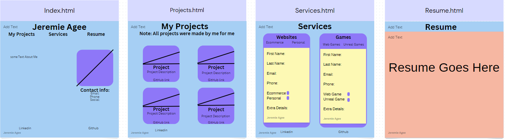

<h1>Personal Website<h1>

<h2>About</h2>

This is a demo personal / professional website. It tells a little about me and some of the things i can do with coding. Using VScode, github, html, javascript, css and bootstrap. 

<h2>Wireframe</h2>

The plan for the site is based on this frame

<h2>Technology used</h2>

The project was wrote in VScode using HTML, CSS, Javascript, Bootstrap, and published on Github.

